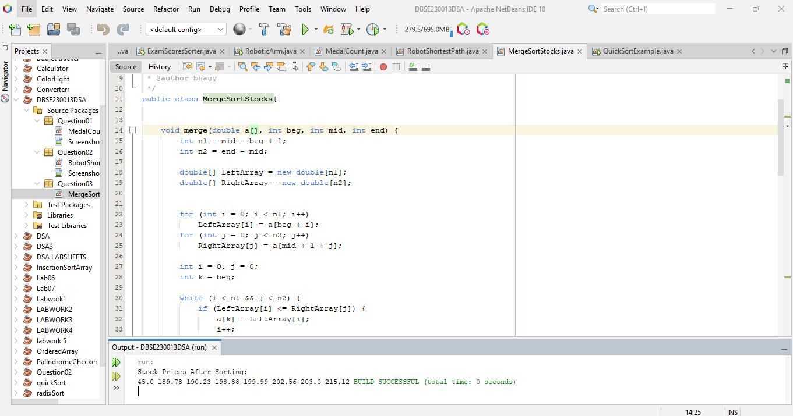

# Sorting Algorithms

This folder contains implementations of common **sorting algorithms** in Java:

1. **Merge Sort** – Q3_MergeSortStocks.java  
2. **Bubble Sort** – Q4_BubbleSort.java  
3. **Shell Sort** – Q5_ShellSort.java  

---

## 1️⃣ Merge Sort – MergeSortStocks.java

**Description:**  
This program sorts an array of stock prices using the **Merge Sort algorithm**.  
Merge Sort is a **divide-and-conquer algorithm** with **time complexity O(n log n)** and is **stable**.

**Sample Output:**  

---

## 2️⃣ Bubble Sort – BubbleSort.java

**Description:**  
Bubble Sort repeatedly compares adjacent elements and swaps them if they are in the wrong order.  
- Simple to implement but **inefficient for large arrays**.  
- Time complexity: **O(n²)**

---

## 3️⃣ Shell Sort – ShellSort.java

**Description:**  
Shell Sort is an optimization over Insertion Sort that allows **exchange of far apart elements**.  
- Uses a gap sequence to reduce total swaps.  
- Time complexity depends on the gap sequence, usually **O(n log n)**.

